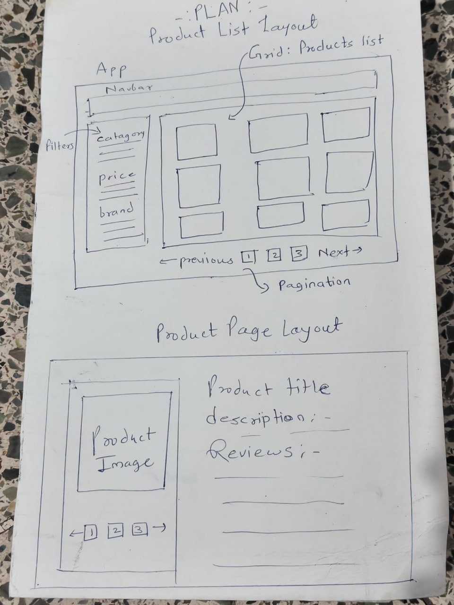

# Leegality Frontend Assessment

This is a frontend assessment built with React. The app showcases a product listing and product detail page. The objective of this assement was to Build a simple e-commerce Product Listing Application using the public API.

## Layout desgning , planing and understanding :

## Setup Instructions :

- Project Setup & Install dependencies:

1. First command to initiate React project - npm create vite@latest.
Removed and clean unnecessary files.
2. Installed react-router-dom, @reduxjs/toolkit, react-redux, sass packages.

## Architectural decisions

1. Used React : because it is fast to setup and provides smooth experience and varierty of feature provided by React.
2. For State management : Used Redux Toolkit for product data, filters, pagination, and search so the state remains centralized and it is easier to manage across components.
3. Components : Broke the UI into reusable components such as ProductCard, StarRating, FilterSidebar, and Pagination to avoid code duplication and improve maintainability.
4. Styling: Used SCSS because I am more comfortable organizing styles with nesting and keeping component styles easier to maintain.
5. API Integration: Product data is fetched from the DummyJSON API and displayed dynamically instead of using hardcoded data.
6. Responsive Layout: CSS Grid and Flexbox were used to create a layout that adapts to different screen sizes.
7. Error & Loading States: Added loading and error handling to provide feedback during API requests and improve user experience.

## Improvements if given more time

1. Add image lazy-loading and responsive sources for performance.
2. Add CI pipeline with linting, tests, and build checks.

